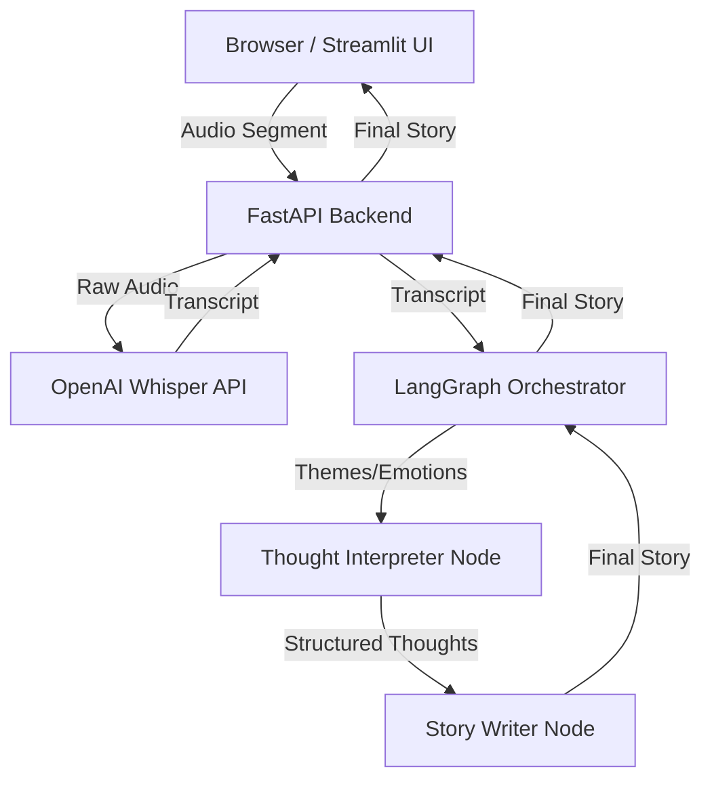
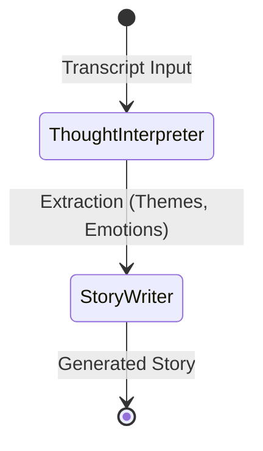

# Miss Writer

Miss Writer is an intelligent voice-to-story agent that seamlessly turns spoken, fragmented thoughts into coherent, well-written stories. By leveraging the power of **OpenAI's Whisper AI** for highly accurate speech-to-text transcription, coupled with **LangGraph**, **OpenAI**, **FastAPI**, and **Streamlit**, this project captures the nuances and emotions of your voice and structures them into compelling narratives.

With the recent addition of **Database Support (SQLite)**, all your generated stories along with their transcribed thoughts are securely saved, allowing you to easily browse, read, and revisit past stories directly within the app.

## Architecture

The system is built as a modular pipeline across several stages:



1. **Audio Capture Layer**: A Streamlit frontend uses `st.audio_input` to record the user's voice naturally.
2. **Speech-to-Text Layer**: The recorded audio is sent to the FastAPI backend, where **OpenAI's Whisper API** converts speech to text with remarkable accuracy.
3. **Thought Structuring Agent**: A LangGraph node (`app/agents/thought_interpreter.py`) invokes GPT to extract `themes`, `emotions`, and `core_ideas` from the raw transcript.
4. **Story Generation Agent**: Another LangGraph node (`app/agents/story_writer.py`) transforms the organized thoughts into a cohesive narrative, preserving the user's emotional tone.
5. **Storage Layer**: The generated story, themes, and transcript are saved to a local **SQLite Database** (`stories.db`) for persistency.
6. **Output & Retrieval Layer**: The FastAPI backend returns the synthesized story to the Streamlit UI. Users can also fetch and browse their history of previously created stories.

### LangGraph Flow




## Project Structure

```text
voice_story_agent/
│
├── app/
│   ├── __init__.py
│   ├── main.py                     # FastAPI backend
│   ├── graph.py                    # LangGraph orchestration
│   ├── database.py                 # SQLite database storage & retrieval
│   ├── agents/
│   │   ├── thought_interpreter.py  # Structured extraction of thoughts
│   │   └── story_writer.py         # Creative writing logic
│   ├── services/
│   │   ├── speech_to_text.py       # Whisper API integration
│   │   └── audio_recorder.py       # Local recording fallback
│   └── utils/
│       └── config.py               # Env settings via pydantic_settings
│
├── requirements.txt
├── .env.example
├── README.md
├── run.py                          # Launcher script runs Backend & UI
└── streamlit_app.py                # Streamlit UI
```

## Setup & Running

1. **Clone or Download the Repository**

2. **Create a Virtual Environment**
   ```bash
   python -m venv .venv
   source .venv/bin/activate  # On Windows: .venv\Scripts\activate
   ```

3. **Install Dependencies**
   ```bash
   pip install -r requirements.txt
   ```

4. **Environment Variables**
   Copy `.env.example` to `.env` and fill in your OpenAI key:
   ```bash
   cp .env.example .env
   # Edit .env and set OPENAI_API_KEY=sk-...
   ```
   *Note: Using sounddevice/soundfile locally may require OS-level audio libraries.*

5. **Run the System**
   ```bash
   python run.py
   ```
   This will start both:
   - FastAPI Backend at: `http://localhost:8082`
   - Streamlit Frontend at: `http://localhost:8501`

   Navigate to [http://localhost:8501](http://localhost:8501), allow microphone access, and start speaking!

## 🐳 Deployment (Docker & Cloud)

This application is fully containerized and ready to be deployed as a shippable product to the internet. 

### Local Docker Testing
If you have Docker Desktop installed, you can run the entire stack locally without installing Python:
```bash
docker-compose up --build
```

### Deploying to Railway.app (Recommended)
Railway is an excellent platform for deploying this agent for free.

1. Create a GitHub repository and push this code to it.
2. Go to **[Railway.app](https://railway.app/)**, sign up with GitHub, and click **New Project** -> **Deploy from GitHub repo**.
3. Select your repository.
4. **Environment Variables (Important):**
   - Click on your new service block, go to the **Variables** tab, and click **New Variable**.
   - Add `OPENAI_API_KEY` with your secret key as the value.
5. **Networking & Domain:**
   - Go to the **Settings** tab and scroll down to **Networking**.
   - Under **Public Networking**, click **Generate Domain**.
   - Ensure the exposed port is selected as `8501` (for Streamlit).
6. Click **Deploy** to publish Miss Writer live!

### Deploying to Render.com (Alternative)
Render is another solid platform for deployment.

1. Create a GitHub repository and push this code to it.
2. Go to **[Render.com](https://render.com/)**, sign up, and click **New > Web Service**.
3. Connect your GitHub repository.
4. **Configuration Settings:**
   - **Environment:** `Docker`
5. **Environment Variables:**
   - Click "Advanced" during setup and add your `OPENAI_API_KEY`.
6. Click **Create Web Service**.
